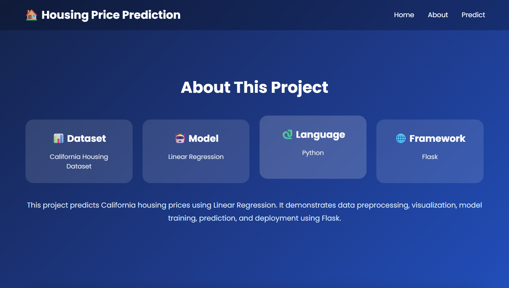
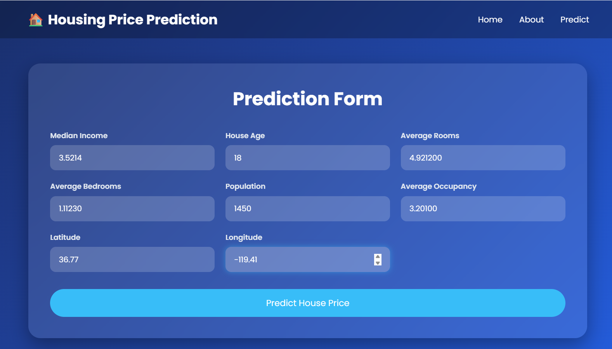
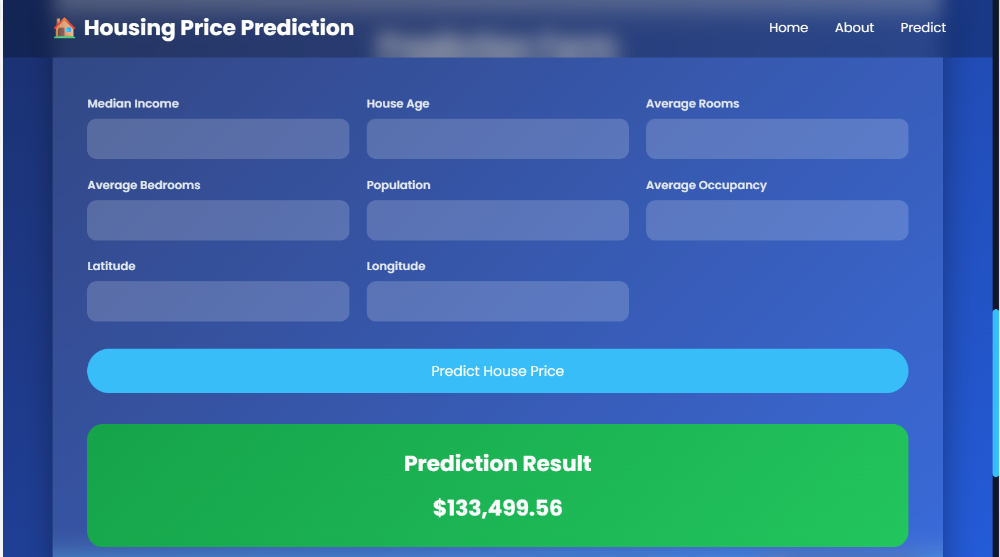

# 🏠 Housing Price Prediction Flask Web Application

A professional Machine Learning web application built with **Flask** that predicts California housing prices using a trained **Linear Regression** model.

---

# 🌐 Live Demo

🔗 **Website:** https://housing-price-prediction-flask.onrender.com

---

# 📌 Project Overview

This project demonstrates the complete deployment of a Machine Learning model using Flask. Users can enter housing-related features and receive an estimated house price instantly through a clean and responsive web interface.

---

# ✨ Features

* 🏠 House Price Prediction
* 🤖 Machine Learning Model (Linear Regression)
* 🌐 Flask Web Application
* 📱 Responsive User Interface
* 🎨 Modern HTML & CSS Design
* 🚀 Deployed on Render
* 📊 Real-time Prediction

---

# 🛠️ Technologies Used

* Python
* Flask
* Scikit-learn
* Pandas
* NumPy
* HTML5
* CSS3
* Pickle
* Render
* GitHub

---

# 📂 Project Structure

```text
Housing-Price-Prediction-Flask/
│
├── app.py
├── model.pkl
├── requirements.txt
├── README.md
│
├── templates/
│   └── index.html
│
├── static/
│   └── style.css
│
├── home.png
├── about.png
├── prediction_form.png
└── predicted_value.png
```

---

# 🤖 Machine Learning Model

**Algorithm**

* Linear Regression

**Dataset**

* California Housing Dataset

**Input Features**

* Median Income
* House Age
* Average Rooms
* Average Bedrooms
* Population
* Average Occupancy
* Latitude
* Longitude

**Output**

* Estimated House Price

---

# 📸 Website Preview

## 🏠 Home Page


---

## 📖 About Section



---

## 📝 Prediction Form



---

## 💰 Prediction Result



---

# ▶️ Installation

Clone the repository

```bash
git clone https://github.com/adityakumarverma647-ai/Housing-Price-Prediction-Flask.git
```

Move into the project

```bash
cd Housing-Price-Prediction-Flask
```

Install dependencies

```bash
pip install -r requirements.txt
```

Run the application

```bash
python app.py
```

Open in your browser

```text
http://127.0.0.1:5000
```

---

# 🚀 Deployment

This project is successfully deployed on **Render**.

**Live Website**

https://housing-price-prediction-flask.onrender.com

---

# 🔮 Future Improvements

* Add Multiple ML Models
* Model Comparison
* User Authentication
* Prediction History
* Interactive Data Visualizations
* Docker Deployment

---

# 👨‍💻 Author

**Aditya Kumar Verma**

B.Tech – Computer Science & Engineering (Artificial Intelligence)

📧 GitHub: https://github.com/adityakumarverma647-ai

---

⭐ If you like this project, don't forget to **Star** this repository.
